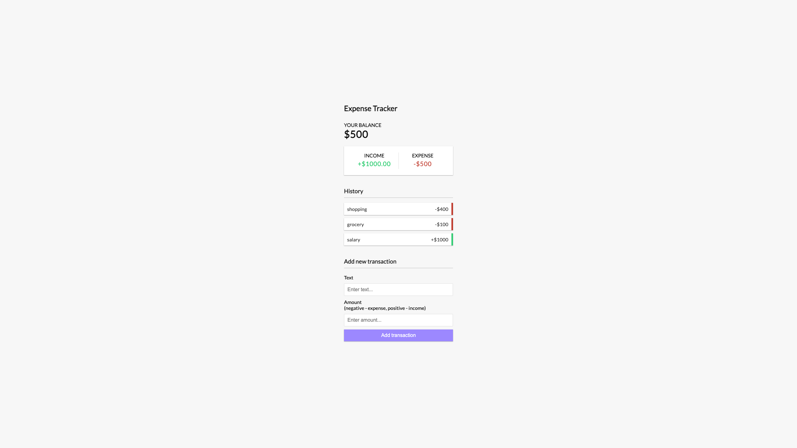

# Expense Tracker Web App

An Expense Tracker web application built using React and the Context API. This application allows users to efficiently manage their financial transactions, track expenses, and gain insights into their spending habits.

## Features

- **User-Friendly Interface:** Intuitive and easy-to-use interface for adding, editing, and deleting expenses.
- **Expense Categories:** Categorize expenses for better organization and analysis.
- **Global State Management:** Utilizes React's Context API for efficient and centralized state management.
- **Responsive Design:** User interface adapts seamlessly to different screen sizes and devices.
- **Local Storage:** Persists data using browser local storage for a consistent experience.

## Getting Started

1. Clone the repository: `git clone https://github.com/Mr-Yasir0/Expense-Tracker`
2. Navigate to the project directory: `cd expense-tracker`
3. Install dependencies: `npm install`
4. Start the development server: `npm start`

## Contributing

Contributions are welcome! If you find any bugs or want to improve the application, feel free to submit an issue or pull request.

## Acknowledgments

- Built with React and the Context API.
- UI inspiration from [insert source if applicable].
